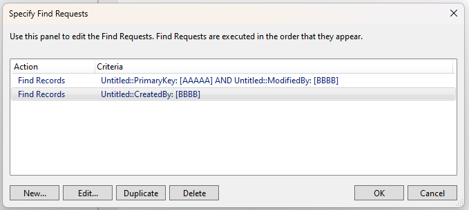

# easy-fm

Making NodeJS + FileMaker easier than ever

easy-fm is a Node.js module that allows you to interact with
a [FileMaker database](https://www.claris.com/filemaker/) stored on
a [FileMaker server](https://www.claris.com/filemaker/server/)
or [FileMaker Cloud](https://store.claris.com/filemaker-cloud). This module interacts with your server using the
[FileMaker Data API](https://help.claris.com/en/data-api-guide/content/index.html).

## FileMaker setup instructions

1. Enable the FileMaker Data API from the server's admin console. This setting is located
   in `Connectors > FileMaker Data API`.
2. Create a FileMaker database account for easy-fm to use. This account must have the 'Access via FileMaker Data API (
   fmrest)' extended privilege

---

## Table of contents

1. [Connecting to a database](#connecting-to-a-database)
    1. [Username and password](#username-and-password)
    2. [Token](#token)
    3. [OAuth](#oauth)
    4. [Claris Account (FileMaker Cloud)](#claris-account--filemaker-cloud-)
2. [Working with records](#working-with-records)
3. [Performing find requests](#perform-find-requests)
4. [Scripts](#scripts)
5. [Index](#index)

---

## Connecting to a database

easy-fm currently does not support connecting to external data sources, or authenticating by any method other than plain
FileMaker authentication.

```javascript
import fm, {FMError} from "easy-fm"; // Import the module
const connection = new fm(
    // Connection options (see below)
);

connection.login().then(token => {
    // Record operations can only be performed after a successful login
})
```

> **NOTE:** A connection will only give you access to the layouts in the database you are connected to, and not the
> layouts
> in
> the external sources that you have specified.
>
> If you need to interact with layouts on multiple databases, you need to open one connection per database.

## Username and password

This method allows you to use a generic FileMaker account to connect to the database.

```javascript
new fm({
    hostname: "localhost",
    database: {
        database: "MyDatabase", // Do not include the .fmp12 file extension
        method: "filemaker",
        username: "node",
        password: "node123"
    },
    externalSources: []
})
``` 

**Supports auto relogin?** Yes

## Token

If you have already created a session with the FileMaker Data API, you can use this to import your session.

```javascript
new fm({
    hostname: "localhost",
    database: {
        database: "MyDatabase", // Do not include the .fmp12 file extension
        method: "token",
        token: "API token goes here"
    },
    externalSources: []
})
``` 

**Supports auto relogin?** No

## OAuth

(untested) If your FileMaker server has OAuth configured, you can login using this method.

```javascript
new fm({
    hostname: "localhost",
    database: {
        f
        database: "MyDatabase", // Do not include the .fmp12 file extension
        method: "oauth",
        oauth: {
            requestId: "oauth request ID",
            requestIdentifier: "oatuh identifier"
        }
    },
    externalSources: []
})
``` 

**Supports auto relogin?** No

## Claris Account (FileMaker Cloud)

(untested) If you'd prefer to use a claris account to login, you can

```javascript
new fm({
    hostname: "localhost",
    database: {
        database: "MyDatabase", // Do not include the .fmp12 file extension
        method: "claris",
        fmid: "" // The FileMaker token provided by Claris
    },
    externalSources: []
})
``` 

Read more [here](https://help.claris.com/en/data-api-guide/content/log-in-database-session-claris-id.html)

**Supports auto relogin?** No

---

## Working with records

When running scripts or interacting with records, the first step that you need to do is get the layout that you want to
use

```javascript
let layout = connection.getLayout("layout1") // Get the layout known as 'layout1'
```

Once you have the layout, you can perform tasks on that layout

> **Note:** You will only be able to get and modify fields that are on that layout. If a field is not on the layout, you
> cannot see or modify it's contents.

### Get a single record using its RecordID

[What's a RecordID?](#recordid)

```javascript
let record_id = 1
let record = layout.getRecord(record_id)

await record.get() // The 'getRecord' method does not automatically get that record's values, so this step does that instead

let field = record.getField("field1")
console.log(field.value) // Get the value of 'field1'
```

### Modify a record

WARNING: The commit step is mandatory. Otherwise the changes will never be uploaded

```javascript
let record_id = 1
let record = layout.getRecord(record_id)

await record.get() // The 'getRecord' method does not automatically get that record's values, so this step does that instead
record.getField("field1").set("This is a value")
record.getField("field2").set("This is also a value")
await record.commit()
```
> **NOTE:** A commit will also commit any changes made to portal records.

### Create a new record

```javascript
let record = await layout.createRecord()
record.getField("field1").set("ABC")
record.getField("field2").set("DEF")
await record.commit()
```

> **WARNING:** The record is *not* created on the database server until a `commit()` step is done.x

### Downloading container field files

```javascript
let record_id = 1
let record = layout.getRecord(record_id)

await record.get() // The 'getRecord' method does not automatically get that record's values, so this step does that instead

let container = record.getField("container")
container.download().then(stream => {
    // Returns an IncomingMessage, which is an extension of ReadableStream
})
```

[IncomingMessage](https://nodejs.org/api/http.html#class-httpincomingmessage)
, [ReadableStream](https://nodejs.org/api/stream.html#class-streamreadable)

### Uploading container files

When uploading files, they should be uploaded as a [Buffer](https://nodejs.org/api/buffer.html) object, along with a
filename (string) and MIME (also string)


```javascript
const fs = require("fs")
let filename = "image.jpg"
let buffer = fs.readdirSync("./" + filename)
let mime = "image/jpeg"

let record_id = 1
let record = layout.getRecord(record_id)
await record.get() // The 'getRecord' method does not automatically get that record's values, so this step does that instead

let container = record.getField("container")
container.upload(buffer, filename, mime).then(() => {
    console.log("UPLOAD SUCCESSFUL!")
})
```

> Mozilla has a list of common MIME types on their website; [(Mozilla) Common MIME types](https://developer.mozilla.org/en-US/docs/Web/HTTP/Basics_of_HTTP/MIME_types/Common_types)

### Read and modify portal information

To be able to read portal information for a record, you'll need to put a portal on the layout you are using. Make sure
you also:

- Give the portal object a name
- Include the exact fields you need in the portal. Any fields you leave out will not be accessible by node.js, and
  putting extra fields in is not a good idea.

```javascript
let record = layout.getRecord(1)

// Portal data is downloaded when the record is fetched
await record.get()
let portal = record.getPortal("Portal1")

for (let _record of portal.records) {
    // Runs for all records in the portal
    let field = _record.getField("field2")
    console.log(field.value)
    field.set("GHI")
}
```

> **WARNING**: Commiting a related portal record will also commit any changes to the parent record as well as any other
portal records.

---

## Perform find requests

Performing find requests is one of the most common database operations



The image above is how the find request would look when doing it in a FileMaker script. This should hopefully help you
understand how the find request process works.

```javascript
let find = layout.newFind() // Create a new find operation

find.addRequests( // Specify the find criteria
    {"PrimaryKey": "AAAAA", "ModifiedBy": "BBBB"},
    {"CreatedBy": "BBBB"}
)

find.addSort("CreatedBy", "ascend") // Sort the results in ascending order
let records = await find.run() // Perform the find
console.log(records)
```

---

### Scripts

Running scripts is another operation you may need to do regularly. This one is fairly straight-forward in how it works

```javascript
let layout = connection.getLayout("layout1")
let script = connection.script("MyFileMakerScript", "This is a parameter")
let result = await layout.runScript(script)
console.log(result)
```

---

## Classes and methods

---

## Index

### RecordID

This is not a custom field that can be set and/or changed. You can get a record's ID from within FileMaker by
using `Get(RecordID)`